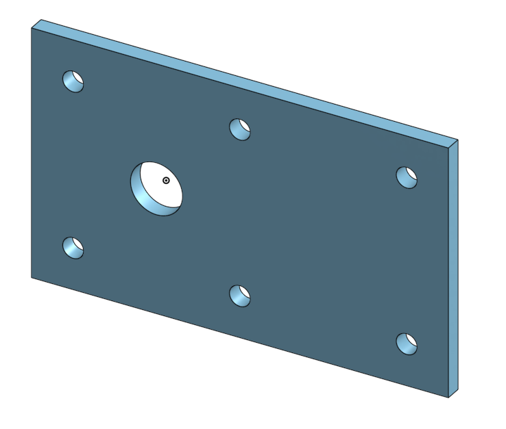

# BasicCAD

We are creating a caster.

---
## Table of Contents
* [Table of Contents](#Table-of-Contents)
* [Base](#Base)
* [Mount](#Mount)
* [Fork](#Fork)
* [Tire](#Tire)
* [Wheel](#Wheel)
* [AxleCollarBearings](#AxleCollarBearings)
* [Dowels](#DorothyDowels)

## Base

### Description

The first assignment is to create the caster base.  The base's dimensions are 200 mm x 120 mm and 8 mm thick.  It has 6 holes 10 mm wide and 20 mm from the edge equally spaced along the edges.

### Evidence
[The Base in Onshape](https://cvilleschools.onshape.com/documents/932a524ffdeb94d5905de1d5/w/71dc14286d77131bb93271b0/e/303f822826f78c954cc0c150)

### Image

### Reflection

This was my first Onshape part and [following along with Dr. Shields made it super easy.](https://www.youtube.com/watch?v=93BFUD-HAG8&feature=emb_title&scrlybrkr=5670f0b4)  I learned about 
* sketching (shortcut **shift-s**)
* constructions lines (shortcut **Q**)
* dimensions (shortcut **D**)
* extruding both add and remove (shortcut key **E**)
* linear patterns (no shortcut)

Onshape is awesome.  I found it really helpful to rename all my sketches.  It is going to be a GREAT year in engineering.

---

## Mount

### Description

The second part for the caster was the mount the mount. We had to make a mount with the following dimensions:
* Is a 120mm x120mm rectangle, centered on the origin.
* Has 4 symmetric holes in the corners, 10mm in diameter, 20mm from each side (and therefore, 80mm from each other)
* Has another 25 mm circle in the center of the square.

### Evidence
[The mount in Onshape](https://cvilleschools.onshape.com/documents/2fef518b5aaf830d9cfbab37/w/17331e35a59fc1c8ca129f6d/e/3aba9f0734a82aad0104b254)
### Image

### Reflection

The mount was very similar to the base except wedid all of the wholes in one sketch. I also learned how to use construction lines using the shortcut l then c.

## Fork

### Description

For this part we had to make a forkshaped part that would hold the wheel. Here were the dimensions:
* 75mm forks with fillets on an 80 mm base. 
* Also a 20mm by 15mm tube coming out the other side.

### Evidence

[The fork in Onshape](https://cvilleschools.onshape.com/documents/ce62ddb4733a890bbe8c54c4/w/1cbffee1717c6a87cdf1c83a/e/f8ba1684593ec77723a22601)

### Image

### Reflection

Since there was no easy video tutorialfrom doctor sheilds, I found myself relyingon my learned onshape skills. I learned that fillets are very easy and similartosolidworks. I also learned how to extrude Symmetricly which splits the distance you extrude. This is helpful when trying to keep a part symmetric to anything.

## Tire

### Description

For this part we made a tire that, in the assembly would surround the wheel. To start you make a trapiziod. Turn it black using constrants and dimensions and then revolve it.

### Evidence

[The Tire in Onshape](https://cvilleschools.onshape.com/documents/b2e73c1ea2dc3f9974994c48/w/e70be189dc83635dd4dc65a5/e/b66baa6e7864a3833ff3e44e)

### Image

### Reflection

I learned many things when making this simple tire. I first learned how to use construction lines when planing to revolve aroung them; use a horizontal line to serve as the center axis and a vertical line to serve as the center  of the revolve. I also learned hat when demensioning a sketch to a horozontal construction lines, you can either use it to define the diameter or the radius.

## Wheel

### Description

For this part I had to make a wheel with spokes, that fit inside the tore and inside the fork. I started with an I shaped sketch and revolved it around a construction line.

### Evidence

[The Wheel in Onshape](https://cvilleschools.onshape.com/documents/bdff0f6bdabef2650724b95f/w/b7ca6557bfe85a56516bda60/e/dbce6e20bda1ff78d42d09f5)

### Image

### Reflection

The wheel was very similar to tire. I mada a shape and revolved it. One small detail I learned is that when revolving a shape with multiple rectangles, I have to select each one when revolving if I want all of them to revolve. I alsolearned how tolinear pattern in onshape; it is almost exactly like solid works.

## AxleCollarBearings

### Description

For the last few parts we had to make three simple parts: the axel, the coller, and two bearings.

### Evidence

[The collar and axel in Onshape](https://cvilleschools.onshape.com/documents/211e198a643c2f34a7314a73/w/26859521983e521178896a1f/e/ed291e7639de6b90bff186a9)
[The bearing in Onshape](https://cvilleschools.onshape.com/documents/7f9ca0402ff4b7ea9dc974e9/w/160ecb198da916d81e8e1188/e/92349d33f22f97fb224a2df3)

### Image

### Reflection

For these last parts, I learned how to create part studios and how I can have assemblies and parts in the same document. This makes it easier to create a whole project in jus one document. Looking back I may have considered doing my entire caaster in just one document.

## DorothyDowels

### Description

For this part we had to make a pin that had 32 differnet configurations:
- 4 length variations
- 4 diameter variations
- Chamfer and no chamfer

### Evidence

[The Dowels in Onshape](https://cvilleschools.onshape.com/documents/27f2712f8e6d37d73f3ee786/w/1c05f774ced416f2a1a4f728/e/0d1a443ce11591a56d3f07bb?configuration=List_Tt29EVM8pZ2JP2%3D_2_inch%3BList_W27A3tRgfpyvKl%3DDefault%3BList_WeUTVxF4ORxrq9%3DDefault)

### Image

### Reflection

I learned many things while making this part. I first learned that if you write "in" onshape will automaticaally cpnvert it into millimeters from inches. I also learned a new shortcut: if you press w, onshape allows you to make a box that it will then zoom in on. Lastly I learned configurations in onshape. I don't remember configurations being this easy in solid works. All you have to do is go to the configurations tab, make a new input, create the names for each configuration and select the feature you would like to configure. If I want to configure a feature itself I just select the supress option when editing that feature.
